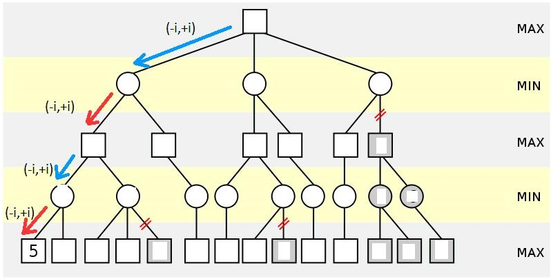

**Cargar Librerias **
```{r}
library("rJava")
library("xlsxjars")
library("xlsx")
require(car)
require(psych)
require(ggpubr)
require(tidyverse)
require(Hmisc)
require(corrplot)
library(ISLR)
library(glmnet)
require(Metrics)
require(MLmetrics)
library(readxl)
library(rpart.plot)
```

# RESUMEN
La palma es la segunda planta más extendida en el mundo. Colombia cuenta con más de 200 especies, y casi 80 de ellas se distribuyen en la región de los llanos orientales. Las especies insignes de esta región se conocen como palma de moriche (Mauritia flexuosa), corozo especie (Attalea butyracea) y corozo especie (Acrocomia aculeata). Estas especies de palma albergan exclusivamente a algunos grupos particulares de triatominos.  Esta exclusividad ha llevado a que el género Rhodnius prolixus,  uno de los vectores de mayor importancia de la enfermedad de Chagas, desarrolle adaptaciones que muestran una historia evolutiva estrechamente relacionada con estas especies. En este sentido se pretende clasificar tres especies de palma a partir de características fisionómicas, micro climáticas y del grado de asociación con el heteróptero triatomino Rhodnius prolixus conocido como (pito) en la región de los llanos orientales. Para realizar la clasificación de la especie de palma se trabajarán diferentes algoritmos de aprendizaje supervisado, los cuales serán evaluados según su desempeño. Para realizar la evaluación de los modelos de clasificación implementados se usara como métrica el Accuracy, que será calculado a partir de la matriz de confusión, que aunque no es una medida de desempeño, si se utilizan sus resultados para calcular las métricas.


#   1. Preprocesamiento de datos

##    1.1   Cargue y Revision inicial de los datos
Se revisa la estructura y cacateristicas de la base de datos

```{r}
datos <-  readxl::read_xlsx("Datos.xlsx")  
str(datos)
```
*Resumen de la base datos*

```{r}
summary(datos)
```

###   1.1.2   Análisis de datos faltantes   
Se revisa si los datos tienen registros faltantes y las dimenssiones de la base datos

```{r}
1 - (sum(complete.cases(datos)) / nrow(datos))
dim(datos)
```
Como se observa la base de datos tiene todos los registros completos. Ahora verificamos de que dimensión quedo la base de datos a analizar.

##    1.2   Descripción general de base de datos.

**Número de instancias** |  **Número de atributos** | 
----------------------| ----------------------|
*105* | 14

|**Variables explicativas**|
|----------------------| 
|**Temperatura**  = *Temperatura ambiente en grados C* | 
|**H_R**  = *Humedad Relativa* | 
|**Macho** = *Genero de la especie]*|
|**Hembra** = *enero de la especie* |
|**N5** = *Ninfas de quinto estadio *|
|**N4** = *Ninfas de cuarto estadio*|
|**N3**= *Ninfas de tercer estadio*|
|**N2** = *Ninfas de segundo estadio*|
|**N1** = *Ninfas de primer estadio* |
|**VCopa(m3)** = * *Volumen de Copa en m3*|
|**N_Hojas** = *Numero de Hojas*|
|**Alturapalma(m)**= *Altura de la palma en mts*|
|**DAP(m)**: *Diametro a la altura del pecho (palma)*|

|**Variable Respuesta**|
|----------------------| 
|**Especie**  = *Especie de Palma* | 


##    1.2   Analisis de variables cuantitativas
creamos un dataset solo con las variables cuantitativas para poderlas analizar mas facilmente

```{r}
cuanti  <-datos[,-c(1)]
head(cuanti)
```
###   1.2.1   Exploración grafica inicial variables cualitativas
Diagrama de cajas de las variables cuantitativas

```{r}
#par(mfrow=c(1,2))
Boxplot(scale(cuanti),las=1,col="blue",main="Boxplot de las variables explicativas")
abline(h=c(-4,4),col=2,lty=2)
```

###   1.2.2.    Analisis de correlacion entre las variables
A continuación, con el paquete PerformanceAnalytics el cual nos permite crear un gráfico de correlación con histogramas, funciones de densidad, líneas de regresión suavizadas y coeficientes de correlación con los niveles de significación (si no hay estrellas, la variable no es estadísticamente significativa, mientras que una, dos y tres estrellas significan que la correspondiente variable es estadísticamente significativa para los niveles 10%, 5% y 1%, respectivamente). 

```{r}
library(PerformanceAnalytics)
chart.Correlation(datos[,c(2:14)],histogram=TRUE, col="grey10", pch=1, main="Correlación de variables asociadas con la especie de palma")
```

####    Conversion de variables categoricas a factores
```{r}
datos_especie <- datos %>%
mutate(Especie = as_factor(Especie))
str(datos_especie)
```

###   1.2.3   Analisis de correlacion incuyendo la variable dependiente (Especie) 
-   Primeras 7 variables
```{r}
library(ggplot2)
library(GGally)
ggpairs(datos[,c(2:8,1)], aes(color=Especie, alpha=0.75), lower=list(continuous="smooth"))+ theme_bw()+
labs(title="Analisis de correlacion incuyendo la Especie")+
theme(plot.title=element_text(face='bold',color='black',hjust=0.5,size=12))
```


-   b.)   Analisis de correlacion incuyendo la especie segundas variable 8 a 14
```{r}
library(ggplot2)
library(GGally)
ggpairs(datos[,c(9:14,1)], aes(color=Especie, alpha=0.75), lower=list(continuous="smooth"))+ theme_bw()+
labs(title="Analisis de correlacion incuyendo la especie")+
theme(plot.title=element_text(face='bold',color='black',hjust=0.5,size=12))
```

-   b.)   Analisis de correlacion incuyendo la especie con variables mas significativas
```{r}
library(ggplot2)
library(GGally)
ggpairs(datos[,c(2,4,5,13,14,1)], aes(color=Especie, alpha=0.75), lower=list(continuous="smooth"))+ theme_bw()+
labs(title="Analisis de correlacion incuyendo la especie")+
theme(plot.title=element_text(face='bold',color='black',hjust=0.5,size=12))
```

```{r}
ggplot(datos_especie,aes(x=N_Hojas, y=DAP, color=Especie)) +
  geom_point()
```

## Analisis de variables mas significativas N_Hojas y DAP

Diagrama de Cajas de la variable DAP y N_Hojas vs las Especies
```{r}
library(plotly)
plot_ly(data = datos_especie, x = ~ Especie, y = ~DAP
        , color = ~Especie
        , type = "box"
        , colors = "Dark2"
)
```

```{r}
library(plotly)
plot_ly(data = datos_especie, x = ~ Especie, y = ~N_Hojas
        , color = ~Especie
        , type = "box"
        , colors = "Set1"
)
```

#   2    Preparacion de los datos

#### Escalar los datos
Este proceso se realiza con el fin de ajustar los valores medidos en diferentes escalas respecto a una escala común. Para aplicar un escalado semejante a las diferentes características tenemos dos enfoques diferentes: el escalado y la normalización. El escalado va a transformar los valores de las características de forma que estén confinados en un rango [a, b], típicamente [0, 1] o [-1, 1]. La normalización va a transformar las características de forma que todas compartan un mismo valor medio y una misma desviación media. 

```{r}
data_escal <-data.frame(datos_especie)
data_escal[, c(2:14)] <- scale(data_escal[, c(2:14)])
summary(data_escal)
```

### Modelo de Regresión  

```{r}
Modelolineal <- glm(Especie ~ ., family = binomial, data = data_escal)
summary(Modelolineal)

```
# Analisis de Multicolinealidad
Multicolinealidad es el t´ermino usualmente utilizado para referirse a la existencia de relaciones lineales o cuasilineales entre las variables predictoras en un modelo lineal, lo que indica que parte sustancial de la informacion en una o mas de estas variables es redundante. El VIF (Factor de Inflación de Varianza, del inglés “Variance Inflation Factor”) de una variable independiente es en un valor que indica el grado de indecencia de esa variable. Para obtener el VIF en primer lugar ha de calcular la regresión lineal de una variable independiente frente a resto de variables independientes.
```{r}
vif(Modelolineal)
```


```{r}
par(mfrow = c(2, 2))
plot(Modelolineal)
```

Teniendo en cuenta que gran parte de las variables presentan un VIF muy alto se puede concluir que existe una alta correlación en las variables explicativas. Por otro lado se quiere realizar una reducción de dimensionalidad por lo tanto se realizara una Analisis de Componenetes principales teniendo en cuenta que cada dimensión o componente principal generado por PCA será una combinación lineal de las variables originales, y serán además independientes o no correlacionadas entre sí, eliminando los problemas de multicolinealidad.


#   3.    Analisis de Componenetes Principales (PCA) 
Realizando un analisis de componentes principales con las 30 variables se observa que con el componenete 6 se obtiene una explicacion de las variables del 88.7% 


```{r}
all_pca <- prcomp(data_escal[,-1], cor=TRUE, scale = TRUE)
summary(all_pca)
```
Con el resultado del ACP se puede observar que con la componenete PC8  se pueden explicar las variables en un 90%, por lo tanto se realizara el analisis y se trabajaran los modelos con las primeras 8 componenetes.

##    3.1   Analisis grafico de los componentes principales

A continuacion de forma grafica se puede analizar el porcentaje de variabilidad que tienen las componenentes

####    a.)  Analisis grafico PCA con todas las varianzas 

```{r}
library(factoextra)
fviz_eig(all_pca, addlabels=TRUE, ylim=c(0,60), geom = c("bar", "line"), barfill = "blue", barcolor="grey",linecolor = "red", ncp=8)+
labs(title = "PCA con 8 Componenetes Principales",
         x = "Componentes principaes PCA", y = "% of varianza")
```

##    3.2    Analisis de correlación de las variables PCA

####     Obtener las Variables PCA 
```{r}
all_var <- get_pca_var(all_pca)
all_var
```

###   3.2.1   Representacion del PCA
Correlación entre las variables y el PCA
```{r}
library("corrplot")
corrplot(all_var$cos2, is.corr=FALSE)
```

###   3.2.2   Contribucions de las variables al PCA
La ide es destacar las variables que más contribuyen a cada componente
```{r}
corrplot(all_var$contrib, is.corr=FALSE)	
```

###   3.2.3   Contribucion de las variables PC1 & PC2
```{r}
library(gridExtra)
p1 <- fviz_contrib(all_pca, choice="var", axes=1, fill="green", color="grey", top=10)
p2 <- fviz_contrib(all_pca, choice="var", axes=2, fill="blue", color="grey", top=10)
grid.arrange(p1,p2,ncol=2)
```


##    3.4   Relación de las Dimensiones 1 y 2 con las variables
```{r}
set.seed(218)
res.all <- kmeans(all_var$coord, centers = 6, nstart = 25)
grp <- as.factor(res.all$cluster)

fviz_pca_var(all_pca, col.var = grp, 
             palette = "jco",
             legend.title = "Cluster")
```

##    3.5 Biplot de las variables relacionadas con PC1 y PC2
```{r}
library("factoextra")
fviz_pca_biplot(all_pca, col.ind = data_escal$Especie, col="black",
                palette = "jco", geom = "point", repel=TRUE,
                legend.title="Especie Palma", addEllipses = TRUE)
```

```{r}
dataset_pca <- data.frame(data_escal$Especie, all_pca$x[,1:8])

#dataset_pca$data_escal.Especie <-(dataset_pca$data_escal.Especie)
#dataset_pca <- dplyr::select(dataset_pca, -`data_escal.Especie`) 
```


##    3.6  Analisis de Multicolinealidad de las componenetes 

###   3.6.1   Modelo lineal PCA (Logistic Regression Classifier) PCA

```{r}
Mod_lineal_PCA <- glm(data_escal.Especie ~ ., family = binomial, data = dataset_pca)
summary(Mod_lineal_PCA)
##    Multicolinealidad PCA
vif(Mod_lineal_PCA)
```

Como se observa ya no existe problemas de multicolinealidad

Teniendo en cuenta los analisis anteriores se trabajara con 8 componentes principales ya que representan un 90%
A continuacion se crea el dataset con los 8 componentes principales


#   4. MODELOS DE CLASIFICACIÓN DE 3 ESPECIES DE PALMA
(Attalea_butyracea, Mauritia_flexuosa y Acrocomia_aculeata )

A continuacion se trabajan los modelos de clasificacion a traves del aprendizaje supervisado, el cual se basa en entrenar a un modelo o método por medio de diferentes datos para poder predecir una variable partiendo de estos mismos datos. 

Los problemas de clasificación parten de un conjunto de datos la cual tiene un conjunto de características y conocemos la clase a la cual pertenece llamándose a este conjunto de entrenamiento o aprendizaje, creando un conjunto de reglas el cual nos permiten validar con un conjunto de datos diferente, permitiendo estimar la precisión del modelo de clasificación.

En los siguientes apartados se entrenan diferentes modelos de machine learning con el objetivo de compararlos e identificar el que mejor resultado obtiene prediciendo la especie de palma. 

Una vez analizados los componenetes principales se realiza la implementación de los modelos de clasificación, entre ellos. la Regresión Logística, (K nearest neighbors) o K-NN, las Máquinas de Soporte Vectorial o SVM por sus siglas en inglés (Support Vector Machines), así como los Árboles de Decisión ( C5.0) y los Bosques Aleatorios (Random Forests Classifier), entre otros.

**Separación de datos en conjunto de entrenamiento y validacion. PCA Significativos**

Se realiza la separacion de datos en conjunto de entrenamiento (80%) y un conjunto de validacion (20%)

```{r}
#install.packages("caTools")
library(caTools)
set.seed(1234)
split2 <- sample.split(dataset_pca$data_escal.Especie, SplitRatio = 0.80)
training_set2 <- subset(dataset_pca, split2 == TRUE)
test_set2 <- subset(dataset_pca, split2 == FALSE)
```

Ver proporcion de datos 
```{r}
table(training_set2$data_escal.Especie)
table(test_set2$data_escal.Especie)
```


##    4.1   MODELO k-NN 

El método K-nn (K nearest neighbors Fix y Hodges, 1951) es un método de clasificación supervisada (Aprendizaje, estimación basada en un conjunto de entrenamiento y prototipos) que sirve para estimar la función de densidad $(f(x/cj))$ de las predictoras $x$   por cada clase  $Cj$.

Este es un método de clasificación no paramétrico, que estima el valor de la función de densidad de probabilidad o directamente la probabilidad a posteriori de que un elemento $x$   pertenezca a la clase  
$Cj$ a partir de la información proporcionada por el conjunto de prototipos o ejemplos. En el proceso de aprendizaje no se hace ninguna suposición acerca de la distribución de las variables predictoras.


###   4.1.1   MODELO k - Vecinos Cercanos sin optimizacion
```{r}
library(class)
set.seed(1234)
pred_valid_knn_PCA <- knn(training_set2[, -1], 
                      test_set2[, -1], 
                      cl = training_set2[, 1],
                      k = 5)
```

###  Matriz de confusion MODELO k - Vecinos

```{r}
library(caret)
tab <- table(test_set2$data_escal.Especie, pred_valid_knn_PCA, dnn = c("Actual", "Predicha"))
confusionMatrix(tab)
```

####   Optimizacion de Hyper-parámetros del MODELO k - Vecinos Cercanos
#####   **Hyper-parámetros**

-   *¿Qué son los hiperparámetros?*
Los hiperparámetros son parámetros ajustables que permiten controlar el proceso de entrenamiento de un modelo. Por ejemplo, con redes neuronales, puede decidir el número de capas ocultas y el número de nodos de cada capa. El rendimiento de un modelo depende en gran medida de los hiperparámetros.
El ajuste de hiperparámetros es el proceso de encontrar la configuración de hiperparámetros que produzca el mejor rendimiento. Normalmente, el proceso es manual y costoso desde el punto de vista computacional.

Para este caso se busca un valor de "k" que tenga el mejor rendimiento de predicción en KNN

```{r}
library(class)

acc_test <- numeric() 

for(i in 1:9){
    predict <- knn(train=training_set2[,-1], test=test_set2[,-1], cl=training_set2[,1], k=i, prob=T)
    acc_test <- c(acc_test,mean(predict==test_set2[,1]))
}

acc <- data.frame(k= seq(1,9), cnt = acc_test)

opt_k <- subset(acc, cnt==max(cnt))[1,]
sub <- paste("El valor de k optimo es", opt_k$k, "(accuracy :", opt_k$cnt,") in KNN")

library(highcharter)
hchart(acc, 'line', hcaes(k, cnt)) %>%
  hc_title(text = "Busqueda del mejor Accuracy variando K - Modelo (KNN)") %>%
  hc_subtitle(text = sub) %>%
  hc_add_theme(hc_theme_google()) %>%
  hc_xAxis(title = list(text = "Number de Vecinos(k)")) %>%
  hc_yAxis(title = list(text = "Accuracy"))

  
```

###   4.1.2   MODELO k-NN Optimizado con el mejor K
```{r}
library(class)
set.seed(1234)
pre_knn <- knn(train = training_set2[,-1], test = test_set2[,-1], cl = training_set2[,1], k=opt_k$k, prob=T)
```

####  Matriz de confusion MODELO k - Vecinos Optimizado
```{r}
cm_knn  <- confusionMatrix(pre_knn, test_set2$data_escal.Especie)
cm_knn
```


##    4.2   MODELO SVM Maquina de Soporte Vectorial con Kernel linear.
Las máquinas de vectores de soporte o máquinas de vector soporte (del inglés Support Vector Machines, SVM) son un conjunto de algoritmos de aprendizaje supervisado desarrollados por Vladimir Vapnik y su equipo en los laboratorios AT&T.

Estos métodos están propiamente relacionados con problemas de clasificación y regresión. Dado un conjunto de ejemplos de entrenamiento (de muestras) podemos etiquetar las clases y entrenar una SVM para construir un modelo que prediga la clase de una nueva muestra. Intuitivamente, una SVM es un modelo que representa a los puntos de muestra en el espacio, separando las clases a 2 espacios lo más amplios posibles mediante un hiperplano de separación definido como el vector entre los 2 puntos, de las 2 clases, más cercanos al que se llama vector soporte. Cuando las nuevas muestras se ponen en correspondencia con dicho modelo, en función de los espacios a los que pertenezcan, pueden ser clasificadas a una o la otra clase.
Función Kernel
La manera más simple de realizar la separación es mediante una línea recta, un plano recto o un hiperplano N-dimensional.

Desafortunadamente los universos a estudiar no se suelen presentar en casos idílicos de dos dimensiones como en el ejemplo anterior, sino que un algoritmo SVM debe tratar con a) más de dos variables predictoras, b) curvas no lineales de separación, c) casos donde los conjuntos de datos no pueden ser completamente separados, d) clasificaciones en más de dos categorías.

Debido a las limitaciones computacionales de las máquinas de aprendizaje lineal, éstas no pueden ser utilizadas en la mayoría de las aplicaciones del mundo real. La representación por medio de funciones Kernel ofrece una solución a este problema, proyectando la información a un espacio de características de mayor dimensión el cual aumenta la capacidad computacional de la máquinas de aprendizaje lineal. Es decir, mapearemos el espacio de entradas X a un nuevo espacio de características de mayor dimensionalidad (Hilbert):


###   4.2.1 MODELO SVM sin optimizar

```{r}
library(e1071)
set.seed(1234)
clasificadorSVM_PCA <- svm(data_escal.Especie ~ ., data = training_set2, 
                       type = 'C-classification', kernel = 'radial')
```

###   Prediccion SVM 
```{r}
pred_valid_svm_PCA <- predict(clasificadorSVM_PCA, newdata = test_set2)
```

###   Matriz de confusion SVM    

```{r}
library(caret)
tab <- table(test_set2$data_escal.Especie, pred_valid_svm_PCA, dnn = c("Actual", "Predicha"))
confusionMatrix(tab)
```

####    Optimizacion del MODELO SVM 

Se elije "gamma, coste" que muestra el mejor rendimiento de predicción en SVM
```{r}
gamma <- seq(0,0.1,0.005)
cost <- 2^(0:5)
parms <- expand.grid(cost=cost, gamma=gamma)    ## 231

acc_test <- numeric()
accuracy1 <- NULL; accuracy2 <- NULL

for(i in 1:NROW(parms)){        
        learn_svm <- svm(data_escal.Especie~., data=training_set2, gamma=parms$gamma[i], cost=parms$cost[i])
        pre_svm <- predict(learn_svm, test_set2[,-1])
        accuracy1 <- confusionMatrix(pre_svm, test_set2$data_escal.Especie)
        accuracy2[i] <- accuracy1$overall[1]
}

acc <- data.frame(p= seq(1,NROW(parms)), cnt = accuracy2)

opt_p <- subset(acc, cnt==max(cnt))[1,]
sub <- paste("Optimal number of parameter is", opt_p$p, "(accuracy :", opt_p$cnt,") in SVM")

library(highcharter)
hchart(acc, 'line', hcaes(p, cnt)) %>%
  hc_title(text = "Accuracy con variación de Parametros para modelo (SVM)") %>%
  hc_subtitle(text = sub) %>%
  hc_add_theme(hc_theme_google()) %>%
  hc_xAxis(title = list(text = "Número de parametros")) %>%
  hc_yAxis(title = list(text = "Accuracy"))
  
```

###   4.2.2 MODELO SVM Optimizado 
```{r}
learn_imp_svm <- svm(data_escal.Especie~., data=training_set2, cost=parms$cost[opt_p$p], gamma=parms$gamma[opt_p$p])
pre_imp_svm <- predict(learn_imp_svm, test_set2[,-1])
```

####    Matriz de confusion MODELO SVM Optimizado 
```{r}
cm_imp_svm <- confusionMatrix(pre_imp_svm, test_set2$data_escal.Especie)
cm_imp_svm
```


##    4.3   MODELO - Naive Bayes 

Naïve Bayes es uno de los clasificadores más utilizados por su simplicidad y rapidez. Se trata de una técnica de clasificación y predicción supervisada que construye modelos que predicen la probabilidad de posibles resultados, en base al Teorema de Bayes, tambiéń conocido como teorema de la probalibidad condicionada: $P\left(AB\right) = \frac{P(B/A)P(A)}{P(B)}$.
El clasificador probabilístico Naive Bayes, tiene sus fundamentos en el Teorema de Bayes, es uno de los algoritmos de aprendizaje práctico más utilizados por su sencillez.
Es una técnica de clasificación y predicción supervisada ya que necesita de ejemplos previos que nos ayuden a clasificar los datos a evaluar, Naïve Bayes nos permite construir modelos que predicen la probabilidad de resultados.

*En el algoritmo Naive Bayes se asume que las variables predictivas inciden de forma independiente sobre la variable cuyos datos se desean clasificar*
**Proceso de Clasificación**

Figura 3. Proceso de Clasificacion Naive Bayes 
```{r}
knitr::include_graphics("BAYES.PNG")
```

###   4.3.1  Generacion del MODELO - Naive Bayes 
```{r}
library(e1071)
set.seed(1234)
clasificadorBayes_PCA <- naiveBayes(data_escal.Especie ~ ., data = training_set2)
```

####    Prediccion MODELO - Naive Bayes    
```{r}
pred_valid_bayes_PCA <- predict(clasificadorBayes_PCA, newdata = test_set2)

```

####    Matriz de confusion MODELO - Naive Bayes

```{r}
library(caret)
tab_Bayesiano <- table(test_set2$data_escal.Especie, pred_valid_bayes_PCA , dnn = c("Actual", "Predicha"))
confusionMatrix(tab_Bayesiano )
```

#### Optimización del MODELO - Naive Bayes
```{r}
library(e1071)

acc_test <- numeric()
accuracy1 <- NULL; accuracy2 <- NULL

for(i in 1:30){
    learn_imp_nb <- naiveBayes(training_set2[,-1], training_set2$data_escal.Especie, laplace=i)    
    p_nb <- predict(learn_imp_nb, test_set2[,-1]) 
    accuracy1 <- confusionMatrix(p_nb, test_set2$data_escal.Especie)
    accuracy2[i] <- accuracy1$overall[1]
}

acc <- data.frame(l= seq(1,30), cnt = accuracy2)

opt_l <- subset(acc, cnt==max(cnt))[1,]
sub <- paste("El valor optimo de Laplace es", opt_l$l, "(accuracy :", opt_l$cnt,") in naiveBayes")

library(highcharter)
hchart(acc, 'line', hcaes(l, cnt)) %>%
  hc_title(text = "Accuracy con Variación de  Laplace (naiveBayes)") %>%
  hc_subtitle(text = sub) %>%
  hc_add_theme(hc_theme_google()) %>%
  hc_xAxis(title = list(text = "Numero de Laplace")) %>%
  hc_yAxis(title = list(text = "Accuracy"))

```
Como se observa en la grafica el modelo no se puede optimizar mas ya que el Acuracy logrado con el modelo optimo sigue siendo el mismo.


##    4.4   MODELO - Arbol de Decision (Decision Tree Classifier)

Los árboles de decisión o de clasificación son un modelo surgido en el ámbito del aprendizaje automático (Machine Learning) y de la Inteligencia Artificial que partiendo de una base de datos, crea diagramas de construcciones lógicas que nos ayudan a resolver problemas. A esta técnica también se la denomina segmentación jerárquica. Es una técnica explicativa y descomposicional que utiliza un proceso de división secuencial, iterativo y descendente que partiendo de una variable dependiente, forma grupos homogéneos definidos específicamente mediante combinaciones de variables independientes en las que se incluyen la totalidad de los casos recogidos en la muestra.
En los árboles de decisión se encuentran los siguientes componentes: nodos, ramas y hojas. Los nodos son las variables de entrada, las ramas representan los posibles valores de las variables de entrada y las hojas son los posibles valores de la variable de salida. Como primer elemento de un árbol de decisión tenemos el nodo raíz que va a representar la variable de mayor relevancia en el proceso de clasificación. Todos los algoritmos de aprendizaje de los árboles de decisión obtienen modelos más o menos complejos y consistentes respecto a la evidencia, pero si los datos contienen incoherencias, el modelo se ajustará a estas incoherencias y perjudicará su comportamiento global en la predicción, es lo que se conoce como sobreajuste. Para solucionar este problema hay que limitar el crecimiento del árbol modificando los algoritmos de aprendizaje para conseguir modelos más generales. Es lo que se conoce como poda en los árboles de decisión.

-   **Arboles de Clasificacion**
Los árboles de clasificación se asemejan mucho a los árboles de regresión, con la diferencia de que predicen variables respuesta cualitativas en lugar de continuas.

Para construir un árbol de clasificación se emplea el mismo método recursive binary splitting descrito en los árboles de regresión. Sin embargo, como la variable respuesta en cualitativa, no es posible emplear el RSS como criterio de selección de las divisiones óptimas. Existen varias alternativas, todas ellas con el objetivo de encontrar nodos lo más puros/homogéneos posible.


Figura 2. Modelo Arbol de Decision
```{r}

```


**Árbol QUEST (Quick, Unbiased, Efficient Statistical Tree)**
Este procedimiento denominado QUEST es el acrónimo de Quick, Unbiased, Efficient Statistical Tree (Árbol Estadístico Eficiente, Insesgado y Rápido). Este método fue propuesto por Loh y Shih (1997).

Este algoritmo trata de corregir y de restringir la exhaustiva búsqueda de particiones significativas que se generan tanto en los algoritmos AID y CHAID como en el CART.

Este método selecciona de forma previa la variable que segmenta mejor los datos, y después realiza la división óptima de ella.

Sintetizando el procedimiento, primero se elige la mejor variable predictora cuyo objetivo es que el número de categorías que poseen las variables no afecte a la elección de la mejor variable, para realizar después la mejor segmentación de la variable que ha seleccionado.

Este método QUEST sólo puede ser utilizado si la variable de salida es categórica nominal.

###   4.4.1 Generacion del MODELO - Arbol de Decision - QUEST  

```{r}
library(rpart)
set.seed(1234)
clasificadorDT_PCA <- rpart(data_escal.Especie ~ ., data = training_set2)
```

####   Predicciones Arbol de Decision - QUEST  
```{r}
pred_valid_DT_PCA <- predict(clasificadorDT_PCA, newdata = test_set2, type = 'class')
```

####    Matriz de confuaion Arbol de Decision  - QUEST  

```{r}
library(caret)
tab_arbol <- table(test_set2$data_escal.Especie, pred_valid_DT_PCA , dnn = c("Actual", "Predicha"))
confusionMatrix(tab_arbol)
```
####    Visualizacion del arbol de decision - QUEST  

```{r}
library(rpart.plot)     
#rpart.plot(clasificadorDT_PCA, main = "Arbol de decisión para Clasificación de especies de palma\n(3 especies)")
rpart.plot(clasificadorDT_PCA, type = 3, clip.right.labs = FALSE,
           branch = .4,
           box.palette = "Gray",       # override default GnBu palette
           main = "type = 3, clip.right.labs = FALSE, ...\n")
```


##    4.5   MODELO con Algoritmo de árbol de decisión - C5.0 

El algoritmo C5 y, sobre todo, su versión no comercial, C4.5, es uno de los algoritmos más utilizados en el ámbito de los árboles de clasificación.

La forma de inferir árboles de decisión a través de este algoritmo es el resultado de la evolución del algoritmo C4.5 (Quinlan, 1993) diseñado por el mismo autor y que a su vez es el núcleo del programa perteneciente a la versión ID3 (Quinlan, 1986b).

Este algoritmo crea modelos de árbol de clasificación, permitiendo sólo variables de salida categórica. Las variables de entrada pueden ser de naturaleza continua o categórica.

El algoritmo básico ID3 construye el árbol de decisión de manera descendente y empieza preguntándose, ¿qué atributo es el que debería ser colocado en la raíz del árbol. Para resolver esta cuestión cada atributo es evaluado a través de un test estadístico que determina cómo clasifica él solo los ejemplos de entrenamiento. Cuando se selecciona el mejor atributo éste es colocado en la raíz del árbol. Entonces una rama y su nodo se crea para cada valor posible del atributo en cuestión. Los ejemplos de entrenamiento son repartidos en los nodos descendentes de acuerdo al valor que tengan para el atributo de la raíz.

El proceso se repite con los ejemplos, para seleccionar un atributo que será ahora colocado en cada uno de los nodos generados. Generalmente el algoritmo se detiene cuando los ejemplos de entrenamiento comparten el mismo valor para el atributo que está siendo probado. Sin embargo, es posible utilizar otros criterios para finalizar la búsqueda:

• Cobertura mínima de tal forma que el número de ejemplos por cada nodo está por debajo de cierto umbral.

• Pruebas estadísticas para probar si las distribuciones de las clases en los subárboles difieren significativamente.

Una de las maneras de cuantificar la bondad de un atributo consiste en considerar la cantidad e información que proveerá ese atributo tal y como está definido en la teoría de la información. Por tanto, este algoritmo está basado en el concepto de “ganancia de información”.

###   4.5.1    MODELO - C5.0
```{r}
library(C50)
learn_c50 <- C5.0(training_set2[,-1],training_set2$data_escal.Especie)
```

####   Prediccion MODELO - C5.0

```{r}
pre_c50 <- predict(learn_c50, test_set2[,-1])
```

####    Matriz de confusion MODELO - C5.0

```{r}
cm_c50 <- confusionMatrix(pre_c50, test_set2$data_escal.Especie)
cm_c50
```

####    Optimización MODELO C5.0 
Hyper-parámetros
El hyper-parámetro más importante para ajustar es el número de variables candidatas a seleccionar para evaluar cada ramificación. Sin embargo, existen algunos adicionales que deben considerarse. Independientemente de los nombres en las distintas librerías, al menos los siguientes deberían estar presentes.
Se optimizan los parametros a fin de obtener el mejor rendimiento de predicción en C5.0
```{r}
library(C50)

acc_test <- numeric()
accuracy1 <- NULL; accuracy2 <- NULL

for(i in 1:50){
    learn_imp_c50 <- C5.0(training_set2[,-1],training_set2$data_escal.Especie,trials = i)      
    p_c50 <- predict(learn_imp_c50, test_set2[,-1]) 
    accuracy1 <- confusionMatrix(p_c50, test_set2$data_escal.Especie)
    accuracy2[i] <- accuracy1$overall[1]
}

acc <- data.frame(t= seq(1,50), cnt = accuracy2)

opt_t <- subset(acc, cnt==max(cnt))[1,]
sub <- paste("El valor optimo es", opt_t$t, "(accuracy :", opt_t$cnt,") in C5.0")

library(highcharter)
hchart(acc, 'line', hcaes(t, cnt)) %>%
  hc_title(text = "Mejor Accuracy logrado para el MODELO (C5.0)") %>%
  hc_subtitle(text = sub) %>%
  hc_add_theme(hc_theme_google()) %>%
  hc_xAxis(title = list(text = "Numero de pruebas")) %>%
  hc_yAxis(title = list(text = "Accuracy"))
```

###   4.5.2    MODELO - C5.0 Optimizado
```{r}		
learn_imp_c50 <- C5.0(training_set2[,-1],training_set2$data_escal.Especie,trials=opt_t$t)	
pre_imp_c50 <- predict(learn_imp_c50, test_set2[,-1])
```

####    Matriz de confusion MODELO - C5.0 Optimizado
```{r}
cm_imp_c50 <- confusionMatrix(pre_imp_c50, test_set2$data_escal.Especie)
cm_imp_c50
```


##    4.6   MODELO - Random Forests 
Random forest (o random forests) también conocidos en castellano como '"Bosques Aleatorios"' es una combinación de árboles predictores tal que cada árbol depende de los valores de un vector aleatorio probado independientemente y con la misma distribución para cada uno de estos. Es una modificación sustancial de bagging que construye una larga colección de árboles no correlacionados y luego los promedia.


Figura 4. Modelo Randomforest
```{r}
knitr::include_graphics("Randomforest.PNG")
```
*   **Ventajas de Random Forest**
Existen muy pocas suposiciones y por lo tanto la preparación de los datos es mínima.
Puede manejar hasta miles de variables de entrada e identificar las más significativas. Método de reducción de dimensionalidad.
Una de las salidas del modelo es la importancia de variables.
Incorpora métodos efectivos para estimar valores faltantes.
Es posible usarlo como método no supervisado (clustering) y detección de outliers.
*   **Desventajas de Random Forest**
Pérdida de interpretación
Bueno para clasificación, no tanto para regresión. Las predicciones no son de naturaleza continua.
En regresión, no puede predecir más allá del rango de valores del conjunto de entrenamiento.
Poco control en lo que hace el modelo (modelo caja negra para modeladores estadísticos)

*Hyper-parámetros*
El hyper-parámetro más importante para ajustar es el número de variables candidatas a seleccionar para evaluar cada ramificación. Sin embargo, existen algunos adicionales que deben considerarse. Independientemente de los nombres en las distintas librerías, al menos los siguientes deberían estar presentes.

###   4.6.1   Generacion del MODELO - Random Forests
```{r}
library(randomForest)
set.seed(123)
clasificadorRF_PCA <- randomForest(data_escal.Especie ~ ., data = training_set2, ntree = 250)
```

####    Predicciones MODELO - Random Forests
```{r}
pred_valid_RF_PCA <- predict(clasificadorRF_PCA, newdata = test_set2)
```

####    Matriz de confusion MODELO - Random Forests

```{r}
library(caret)
tab_RF <- table(test_set2$data_escal.Especie, pred_valid_RF_PCA , dnn = c("Actual", "Predicha"))
confusionMatrix(tab_RF)
```

####    Grafica de la tasa de error Vs numero de arboles
```{r}
plot(clasificadorRF_PCA, main="Random Forest (Tasa de Error vs. Número de arboles)")
```


##    4.7  MODELO Red Neuronal Artificial - RNA con algoritmo Backpropagation

Una Red Neuronal Artificial (RNA) es un modelo matemático inspirado en el comportamiento biológico de las neuronas y en cómo se organizan formando la estructura del cerebro. Las redes neuronales intentan aprender mediante ensayos repetidos como organizarse mejor a si mismas para conseguir maximizar la predicción.

###   4.7.1.    Generación del Modelo RNA  - Algoritmo Backpropagation

```{r}
library(neuralnet)
#library(MMmisc)
nn <- neuralnet(data_escal.Especie ~ ., data = training_set2, hidden = 7,
                rep = 1, 
                linear.output = FALSE, 
                threshold = 0.01, 
                stepmax = 10000, 
                algorithm = "backprop",
                learningrate = 0.2)
```

#### Grafica de la RNA - Implementada
```{r}
print(nn$act.fct)
plot(nn)
```
####    Predicciones MODELO - RNA
```{r}
pred_RNA <- predict(nn, test_set2, type = "class")
#print(pred_RNA)
```

####    Matriz de confusion MODELO - RNA

```{r}
apply(pred_RNA, 1, which.max)
matrizConfusion <- table(test_set2$data_escal.Especie, apply(pred_RNA, 1, which.max))
matrizConfusion
```

####    Calculo de la medida de desempeño  Accuracy para la RNA
```{r}
accuracy_RNA <-round((sum(diag(matrizConfusion))/sum(matrizConfusion)),4)
accuracy_RNA
```


#   6   Comparación de modelos

Una vez que se han entrenado y optimizado distintos modelos, se tiene que identificar cuál de ellos consigue mejores resultados para el problema en cuestión, en este caso, predecir la especie de palma. Con los datos disponibles, existen dos formas de comparar los modelos. Si bien las dos no tienen por qué dar los mismos resultados, son complementarias a la hora de tomar una decisión final.

Métricas de validación
Una de las fases principales en todo el proceso de análisis de datos es la evaluación del modelo. 
 Se trata de evaluar la calidad de un modelo aprendido, cuantificado mediante una varias métricas que evalúan el rendimiento del modelo
> Para que queremos evaluar un modelo?
  Comparar distintos modelos, para elegir el mejor
  Estimar como se comportara el modelo, una vez puesto en marcha
  Convencer al cliente de que el modelo cumplirá su propósito


###   Metodologías y métricas 

*   **Metodologías:**
 ¿Como diseñamos el experimento de evaluación del modelo?
    +   *Holdout, validacion cruzada, bootstrap,. . .*

*   **Métricas:**
 ¿Como medimos el rendimiento de un modelo?
    +   *Accuracy, Precision, Recall, Curvas ROC, AUC,. .*

Tabla 3: Comparación, por la medida de desempeño Accuracy modelos PCA

**No**|    **Modelos PCA** |  **Valor de Accuracy ** | 
----------------------| ----------------------|----------------------|
1 | *Modelo K- NN Vecinos Cercanos* | 0.9048
2 | *Modelo SVM Maquina de Soporte Vectorial* | **0.9524**                  
3 | *Modelo Naive Bayes* | 0.7619                    
4 | *Modelo Arbol de Decision (Decision Tree Classifier)* | 0.9048                      
5 | *Modelo C5.0* | **0.9524**                       
6 | *Modelo Random Forests* | **0.9524**      
6 | *Modelo Red Neuronal Artificial* |  *0.9524*    

Con base en los resultados obtenidos en la 12, se puede ver que se obtuvo un Accuracy máximo de 0.9524. Este valor indica el número de elementos clasificados correctamente en comparación con el número total de elementos. En otras palabras, el modelo clasifica bien la especie de palma en un 95% con las variables predictoras escogidas.

Un hallazgo interesante es que 4 de los 7 modelos implementados lograron el máximo Accuracy de 0.9524, algunos de estos modelos luego de un proceso de optimización de hiper parámetros. 

Uno de los modelos más eficientes y que entrega un Accuracy muy alto fue la maquina de soporte vectorial, ya que obtuvo el Accuracy más alto sin necesidad de optimizar los parámetros.
Otro modelo que entrego una muy buena clasificación fue el modelo realizado con el algoritmo C5.0, se nota que es un algoritmo muy robusto. En cuanto al RNA, también clasifica muy bien, sin embargo, cada vez que se corre el modelo tiende a entregar la clasificación de forma diferente, esto se debe a la naturaleza del algoritmo.
En cuanto al algoritmo Naive bayes no fue posible mejorar su rendimiento, por lo tanto, fue el peor modelo de acuerdo con la medida de rendimiento.

Se debe tener en cuenta que los datos presentan muchos puntos atípicos, por lo tanto, los mejores modelos que clasificaron son aquellos que tiene poca afectación de los puntos atípicos.

En cuanto a trabajar con el Análisis de Componentes Principales, permitió reducir las dimensiones de 14 variables iniciales a 8 componentes con una explicación de las variables del 90%.

Se puede concluir que la eficiencia de los modelos para calcular especies de palma fue muy bueno y esto se podría explicar desde el punto de vista de los datos en que los valores poblacionales y de estructura de edades encontradas en las especies de palma A. butyracea podría deberse a que ésta especie de palma le oferta mejores condiciones de hábitat y micro clima, que le permiten adaptaciones biológicas y reproductivas interesantes a la especie de triatomino Rhodnius prolixus. Por esto se pueden ver diferencias con otras especies de palma.

De otro lado se puede analizar que las variables ambientales y las variables fisionómicas de las palmas están correlacionadas con la especie de triatomino Rhodnius prolixus. 

Finalmente se puede decir que las variables escogidas si clasifican correctamente la especie de palma. Este hallazgo es muy interesante ya que la idea n trabajos futuros será la de agregarle mas variables a la base de datos como, por ejemplo, niveles de lluvia, distancia a las casas más cercanas, radiación solar, velocidad del viento, índices de vegetación entre otras para identificar finalmente la probabilidad de infección de la enfermedad del Chagas respecto a la ubicación de las especies de palma. Este tipo de trabajos serán fundamentales para la prevención de esta enfermedad.


# 10. Conclusion

Los modelos de clasificación son herramientas interdisciplinarias muy importantes para entender la complejidad que caracteriza los sistemas biológicos y ambientales. El trabajar con variables micro climáticas, biológicas y fisionómicas de las especies de palma es un reto interesante ya que estos sistemas son no lineales y presentan gran variabilidad en los datos. Po este motivo fue de gran importancia el trabajar con Análisis de Componentes Principales, ya que esto permitió reducir la dimensionalidad de 14 variables a 8 componentes, lo cual ayudo a mayor la eficiencia en los modelos desarrollados. Los modelos utilizados fueron modelos de clasificación multi-clase, por lo tanto, no se pudo trabajar con aquellos modelos que funcionan para predecir sistemas binarios como la regresión logística y otros. Los métodos de ensamble de modelos o métodos combinados como el C5.0 o Random Forest, son métodos muy potentes y no dependen mucho del comportamiento de los datos ni de los puntos atípicos, esto logra medidas de rendimiento muy buenas. Otro modelo que funciono muy bien con pocos ajustes de hiper parámetros fue la Maquina de Soporte Vectorial. En cuanto a la RNA clasifica muy bien siempre y cuando se entrene con los parámetros adecuados. Desde el punto de vista de los datos del sistema se puede concluir que la relación de la condición micro climática y las características estructurales de la palma están correlacionadas con la población de R. prolixus, esto permitió que los datos lograran clasificar muy bien las especies de palma.


#   11. Bibliografia

Arias-Giraldo, L. M., Muñoz, M., Hernández, C., Herrera, G., Velásquez-Ortiz, N., Cantillo-Barraza, O., Urbano, P., Cuervo, A., & Ramírez, J. D. (2020). Identification of blood-feeding sources in Panstrongylus, Psammolestes, Rhodnius and Triatoma using amplicon-based next-generation sequencing. Parasites and Vectors, 13(1). https://doi.org/10.1186/s13071-020-04310-z
Casanare, S. de S. de. (2020). Casos confirmados de la enfermedad de Chagas en Casanare. Gobernación de Casanare. https://www.casanare.gov.co/Prensa/SaladePrensa/Paginas/Aumentan-los-casos-confirmados-de-la-enfermedad-de-Chagas-en-Casanare.aspx
Dormann, C. F., Elith, J., Bacher, S., Buchmann, C., Carl, G., Carré, G., Marquéz, J. R. G., Gruber, B., Lafourcade, B., Leitão, P. J., Münkemüller, T., Mcclean, C., Osborne, P. E., Reineking, B., Schröder, B., Skidmore, A. K., Zurell, D., & Lautenbach, S. (2013). Collinearity: A review of methods to deal with it and a simulation study evaluating their performance. Ecography, 36(1), 27–46. https://doi.org/10.1111/j.1600-0587.2012.07348.x
Li, J., Zhong, P. an, Yang, M., Zhu, F., Chen, J., Liu, W., & Xu, S. (2020). Intelligent identification of effective reservoirs based on the random forest classification model. Journal of Hydrology, 591, 125324. https://doi.org/10.1016/j.jhydrol.2020.125324
Liu, M. Z., Shao, Y. H., Li, C. N., & Chen, W. J. (2020). Smooth pinball loss nonparallel support vector machine for robust classification. Applied Soft Computing, 106840. https://doi.org/10.1016/j.asoc.2020.106840
Mailagaha Kumbure, M., Luukka, P., & Collan, M. (2020). A new fuzzy k-nearest neighbor classifier based on the Bonferroni mean. Pattern Recognition Letters, 140, 172–178. https://doi.org/10.1016/j.patrec.2020.10.005
Mortaz, E. (2020). Imbalance accuracy metric for model selection in multi-class imbalance classification problems. Knowledge-Based Systems, 210, 106490. https://doi.org/10.1016/j.knosys.2020.106490
Sadeghi, R., Zarkami, R., Sabetraftar, K., & Van Damme, P. (2012). Application of classification trees to model the distribution pattern of a new exotic species Azolla filiculoides (Lam.) at Selkeh Wildlife Refuge, Anzali wetland, Iran. Ecological Modelling, 243, 8–17. https://doi.org/10.1016/j.ecolmodel.2012.06.011
Toğaçar, M., Ergen, B., & Cömert, Z. (2020). Classification of flower species by using features extracted from the intersection of feature selection methods in convolutional neural network models. Measurement: Journal of the International Measurement Confederation, 158, 107703. https://doi.org/10.1016/j.measurement.2020.107703
Urbano, P., Poveda, C., & Molina, J. (2015). Effect of the physiognomy of Attalea butyracea (Arecoideae) on population density and age distribution of Rhodnius prolixus (Triatominae). Parasites and Vectors, 8(1), 1–12. https://doi.org/10.1186/s13071-015-0813-6
Wang, Y., Liu, J., Li, R., Suo, X., & Lu, E. (2020). Precipitation forecast of the Wujiang River Basin based on artificial bee colony algorithm and backpropagation neural network. Alexandria Engineering Journal, 59(3), 1473–1483. https://doi.org/10.1016/j.aej.2020.04.035
Zhang, L., Huettmann, F., Zhang, X., Liu, S., Sun, P., Yu, Z., & Mi, C. (2019). The use of classification and regression algorithms using the random forests method with presence-only data to model species’ distribution. MethodsX, 6, 2281–2292. https://doi.org/10.1016/j.mex.2019.09.035


	 